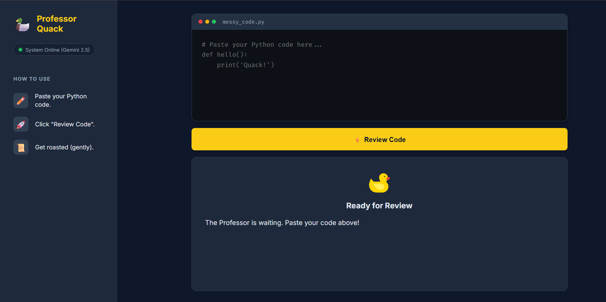

Markdown

# 🦆 Professor Quack - AI Code Reviewer


> **"I don't just find bugs; I eat them for breakfast!"** 🐛

### 🚀 **"This project demonstrates how to architect and deploy a scalable, production-ready GenAI application on Vertex AI in under 15 minutes."**

👉 **[Try the Live Demo Here](https://professor-quack-1060337103276.europe-west1.run.app/)**

**Professor Quack** is a cloud-native, AI-powered code reviewer built entirely on the **Google Cloud Platform (GCP)** ecosystem.

Designed to demonstrate the power of **Vertex AI**, this application moves beyond simple API wrappers. It leverages Google's enterprise machine learning platform to provide secure, scalable, and low-latency code analysis using the **Gemini 2.5 Flash** model. It acts as a sentient "Rubber Duck" that roasts your code with puns, fixes your logic, and teaches you best practices (PEP-8).



---

## ✨ Features

- **🧠 Enterprise AI (Vertex AI):** Powered by the **Vertex AI API**, ensuring high availability, data privacy, and direct access to Google's **Gemini 2.5 "Thinking" model**.
- **☁️ Serverless Scale (Cloud Run):** Deployed on **Google Cloud Run**, allowing the app to scale from 0 to 1,000+ instances automatically based on traffic.
- **🤣 Personality Engine:** Reviews are delivered with humor, empathy, and duck-themed puns.
- **🎨 Pro Code Editor UI:** A dark-mode, VS Code-inspired interface with syntax highlighting and split-screen scrolling.
- **⚡ Low Latency:** Optimized deployment in `europe-west1` (Belgium) for instant responses.
- **💾 Cloud Persistence:** Every review is logged to **Google Firestore** (NoSQL) for real-time analytics and audit trails.

---

## 🏗️ Google Cloud Architecture

This project is a perfect example of a **Serverless Monolithic** architecture on GCP. It demonstrates how to decouple the AI logic from the application layer using Google's managed services.


1.  **The Brain (Vertex AI API):** Unlike standard API keys, this uses **IAM (Identity and Access Management)** authentication. The app communicates directly with Google's data centers to invoke `gemini-2.5-flash` for deep logic analysis.
2.  **The Host (Cloud Run API):** The Flask application is containerized and served via Cloud Run. This ensures you **only pay for the milliseconds the code is running**. It scales to zero when no one is using it.
3.  **The Memory (Firestore API):** A serverless NoSQL database that stores every query. It integrates natively with Cloud Run for sub-millisecond write speeds.

---

## 🛠️ How we built this (Step-by-Step)

This project was built in 5 distinct phases using the **GCP Console** and **Cloud Shell Editor**.

### **Phase 1: The Environment (GCP Setup)**
We started by creating a Google Cloud Project and enabling the essential APIs that power the modern AI stack:
* `aiplatform.googleapis.com` (For Gemini Models)
* `run.googleapis.com` (For Serverless Hosting)
* `firestore.googleapis.com` (For Database)

### **Phase 2: The Brain (Vertex AI SDK)**
Instead of using standard HTTP requests, we integrated the **Vertex AI SDK for Python**.
* We initialized the client with `vertexai.init(location="europe-west1")`.
* We configured the **Gemini 2.5 Flash** model with a custom "System Prompt" (Persona) that instructs the AI to act like a Senior Developer Rubber Duck.

### **Phase 3: The API (Flask)**
We built a lightweight Python Flask server to act as the bridge.
* The `/review` endpoint receives code from the user.
* It passes the code to Vertex AI.
* It returns the AI's Markdown response to the frontend.

### **Phase 4: The Memory (Firestore)**
To track usage and improve the agent, we connected a **Firestore Native** database.
* Every time a user requests a review, the Python app asynchronously saves the input code and the AI's response to a `reviews` collection.
* This allows for audit logging without slowing down the user experience.

### **Phase 5: The Deployment (Cloud Run)**
Finally, we containerized the application using **Docker** and deployed it to **Cloud Run**.
* This gives us a secure HTTPS URL automatically.
* It handles all SSL certificates and load balancing for us.

---

## 📂 Project Structure

```text
professor-quack/
├── main.py                  # 🐍 Flask Server (Intefaces with GCP APIs)
├── duck_brain.py            # 🧠 Vertex AI Logic (Gemini Model Configuration)
├── requirements.txt         # 📦 Dependencies (google-cloud-aiplatform, firestore)
├── Dockerfile               # 🐳 Cloud Run Container Config
│
├── templates/               # 📄 HTML Views
│   └── index.html           #    Single-Page App UI
│
└── static/                  # 🎨 Assets
    ├── style.css            #    Dark Mode Styling
    └── script.js            #    Frontend Logic

```
## 🚀 Getting Started
Prerequisites
Google Cloud Project with Billing Enabled.

Google Cloud CLI (gcloud) installed.

Python 3.9+.

1. Clone the Repository
```bash
git clone [https://github.com/your-username/professor-quack.git](https://github.com/your-username/professor-quack.git)
cd professor-quack
```
2. Enable Google Cloud APIs
Since this project relies on GCP services, you must enable the specific APIs:

```bash
gcloud services enable aiplatform.googleapis.com run.googleapis.com firestore.googleapis.com
```
3. Local Setup
You must authenticate with Google Cloud so your local Python script can talk to Vertex AI.

```bash
# Install dependencies
pip install -r requirements.txt
```

# Authenticate with your Google Cloud user
```bash
gcloud auth application-default login
```

# Run the app locally
```bash
python main.py
```
Visit: http://localhost:8080

## ☁️ Deployment (Google Cloud)
This project is optimized for Cloud Run to demonstrate a production-ready environment.

### **Step 1: Create the Database**
- Go to Google Cloud Console -> Firestore.

- Create a Database in Native Mode.

- Name it: quack (Important! The code looks for this specific name).

- Location: europe-west1 (Best practice: keep DB close to the server and you can choose another region).

### **Step 2: Deploy to Cloud Run**
Run the following command. This zips your code, builds it using Google Cloud Build, and deploys it to a URL.

```bash
gcloud run deploy professor-quack \
  --source . \
  --region europe-west1 \
  --allow-unauthenticated
  ```
The CLI will return a Service URL (e.g., https://professor-quack-xyz.a.run.app). Your enterprise-grade agent is live!

## 🤝 Contributing
We welcome contributions from the community!

- Fork the project.

- Create your Feature Branch (git checkout -b feature/AmazingFeature).

- Commit your changes (git commit -m 'Add some AmazingFeature').

- Push to the Branch (git push origin feature/AmazingFeature).

- Open a Pull Request.

## 🌟 Show your support
Give a ⭐️ if this project helped you learn Google Cloud & Vertex AI!
